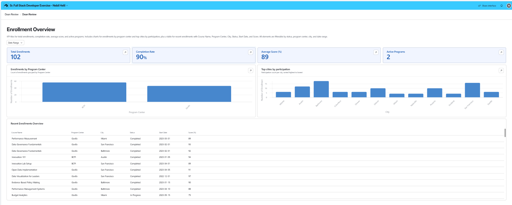

# JHU Government & Policy — Enrollment Data Pipeline & Dashboard

[](LICENSE)
[](https://www.python.org/)
[](https://nodejs.org/)
[](https://react.dev)
[](https://vitejs.dev)

🔗 **[Live Dashboard](https://neba1234.github.io/jhu-enrollment/)** — Real-time data from Airtable via Vercel backend API

🔒 **Airtable Interface (Dean Review)**: Available upon request (not publicly shared).

A full-stack solution for parsing, cleaning, uploading to Airtable, and visualizing enrollment data for the Johns Hopkins University School of Government & Policy.

---

## Table of Contents

- [Overview](#overview)
- [Project Structure](#project-structure)
- [Quick Start](#quick-start)
- [Architecture](#architecture)
- [Airtable Interface](#airtable-interface)
- [Key Findings](#key-findings)
- [Technical Decisions](#technical-decisions)
- [Requirements](#requirements)
- [Contributing](#contributing)
- [Changelog](#changelog)
- [License](#license)

---

## Overview

This project addresses three deliverables from the team:

1. **Data Cleaning** — Parse a raw CSV with deeply nested, multi-delimiter fields into normalized, relational tables.
2. **Airtable Integration** — Upload cleaned data to an Airtable base via the REST + Metadata APIs so the team can review before the funder meeting.
3. **Dean's Dashboard** — An interactive React visualization answering: *Where have we had the most impact?* and *Which cities are most engaged?*

---

## Project Structure

```
jhu-enrollment/
├── src/
│   ├── parse_data.py              # Data parsing & normalization
│   └── airtable_upload.py         # Airtable API upload (creates fields + records)
├── data/
│   ├── enrollment_data.csv        # Raw source data
│   └── cleaned/                   # Generated clean CSVs + JSON
│       ├── leaders.csv
│       ├── cities.csv
│       ├── enrollments.csv
│       └── enrollment_data.json
├── dashboard/                     # React + Vite interactive dashboard
│   ├── src/
│   │   ├── App.jsx
│   │   ├── components/
│   │   │   ├── Header.jsx         # JHU-branded header
│   │   │   ├── KPIStrip.jsx       # 5 headline metric cards
│   │   │   ├── CityChart.jsx      # Stacked bar chart + city grid
│   │   │   ├── ProgramCharts.jsx  # BCPI/GovEx donut + course popularity
│   │   │   ├── Timeline.jsx       # Monthly enrollment area chart
│   │   │   ├── DetailTable.jsx    # Sortable, searchable table
│   │   │   ├── Insights.jsx       # 4 narrative takeaways
│   │   │   └── UI.jsx             # Shared Card, Badge, SectionTitle
│   │   ├── data/
│   │   │   ├── fetchAirtableData.js   # Vercel backend API client
│   │   │   └── useEnrollmentDataLive.js  # Live data hook (all derived metrics)
│   │   └── styles/
│   │       └── global.css
│   ├── package.json
│   └── vite.config.js
├── api/                           # Vercel serverless functions
│   ├── leaders.js
│   ├── cities.js
│   └── enrollments.js
├── docs/                          # GitHub Pages build output
├── requirements.txt
└── README.md
```

---

## Quick Start

### Prerequisites

- **Python 3.10+** with pip
- **Node.js 18+** with npm (for the React dashboard)
- An **Airtable account** (free tier works)

### 1. Install Python Dependencies

```bash
pip install -r requirements.txt
```

### 2. Parse & Clean the Data

```bash
python src/parse_data.py
```

Output:
```
✅ Saved clean data to data/cleaned/
   • 20 leaders
   • 12 cities
   • 51 course enrollments
```

### 3. Upload to Airtable

Create a base with three tables named **Leaders**, **Cities**, **Enrollments** (see [docs/airtable_setup.md](docs/airtable_setup.md)). The **Enrollments** table uses linked records to maintain relational integrity:
- **Leader Name** → Link to Leaders
- **City** → Link to Cities

Then:

```powershell
# PowerShell
$env:AIRTABLE_PAT = "patXXXXXXXXXX"
$env:AIRTABLE_BASE_ID = "appXXXXXXXXXX"
python src/airtable_upload.py
```

```bash
# Mac/Linux
export AIRTABLE_PAT="patXXXXXXXXXX"
export AIRTABLE_BASE_ID="appXXXXXXXXXX"
python src/airtable_upload.py
```

**⚠️ Security Warning:** Never commit API keys or personal access tokens. Use environment variables or a `.env` file (add `.env` to `.gitignore`). The script automatically creates all required fields via the Metadata API, then uploads records in batches of 10.

### 4. Launch the React Dashboard

```bash
cd dashboard
npm install
npm run dev
```

Open `http://localhost:5173` in your browser.

---

## Architecture

### Data Flow

```
enrollment_data.csv
        ↓
  parse_data.py (normalize & validate)
        ↓
  cleaned/enrollment_data.json
        ↓
  airtable_upload.py (create schema + batch records)
        ↓
  Airtable Base (Leaders, Cities, Enrollments with linked records)
        ↓
  Vercel Serverless API (/api/leaders, /api/cities, /api/enrollments)
        ↓
  Live Dashboard on GitHub Pages (neba1234.github.io/jhu-enrollment)
```

### Component Architecture

**Backend:**
- `parse_data.py` — Parses multi-delimiter CSV, creates relational DataFrames, exports JSON
- `airtable_upload.py` — Creates Airtable schema via Metadata API, uploads records via batch REST API
- `/api/*.js` (Vercel) — Serverless functions that proxy Airtable API calls securely (credentials never exposed to client)

**Frontend:**
- `fetchAirtableData.js` — Fetches data from Vercel backend API
- `useEnrollmentDataLive.js` — Live data hook with derived metrics
- 8 React components — Focused presentation layer; no business logic
- Global CSS — Dark mode, animations, responsive design via CSS custom properties

---

## Deployment

### Live Dashboard

```
https://neba1234.github.io/jhu-enrollment/
```
- Fetches live data from Airtable via Vercel backend API
- Shows "🔴 ● LIVE" badge when connected
- Refresh button to update data in real-time
- Frontend hosted on GitHub Pages, backend on Vercel

### To Deploy Your Own Version

1. **Fork this repo** to your GitHub account
2. **Update GitHub Actions** (optional) or build locally:
   ```bash
   cd dashboard && npm run build
   ```
3. **Copy to `/docs`:**
   ```bash
   cp -r dashboard/dist/* docs/
   ```
4. **Enable GitHub Pages** in Settings → Pages:
   - Source: Deploy from a branch
   - Branch: main
   - Folder: /docs

5. **(Optional) Deploy Vercel backend for truly live data:**
   - Install Vercel CLI: `npm i -g vercel`
   - Run: `vercel`
   - Add environment variables: `AIRTABLE_PAT`, `AIRTABLE_BASE_ID`
   - Update frontend base URL in `src/data/fetchAirtableData.js`

---

## Airtable Interface

The Airtable Interface is kept private for safety. If needed, screenshots can be shared upon request.

Screenshots:



---

## Key Findings

| Metric | Value |
|--------|-------|
| Government leaders enrolled | 20 |
| Cities reached | 12 |
| Course enrollments | 51 |
| Completion rate | 90% |
| Average score (completed) | 91.8% |

**Top cities by engagement:**

1. **Baltimore, MD** — 9 enrollments, 4 leaders, 92.1% avg score
2. **San Francisco, CA** — 8 enrollments, 3 leaders, 92.6% avg score
3. **Austin, TX** — 6 enrollments, 2 leaders, 93.5% avg score

**Program centers:** BCPI leads with 28 enrollments (55%), GovEx has 23 (45%).

---

## Technical Decisions

### Data Parsing
The raw CSV uses three layers of delimiters within single fields: pipes (`|`) for sub-records, tildes (`~`) for course attributes, and colons (`:`) for key-value pairs. The parser handles each layer independently, then joins on course name to match enrollments with completion statuses.

### Airtable Integration
The upload script uses the Airtable **Metadata API** (`/meta/bases/{id}/tables/{id}/fields`) to programmatically create fields with correct types (number, date, email, text) before uploading any records. This avoids the "Unknown field name" errors that occur with the standard Records API alone. Records are uploaded in batches of 10 with rate limiting (250ms between requests).

### React Dashboard
Built with **Vite + React + Recharts**. Component architecture separates data processing (`useEnrollmentDataLive` hook) from presentation (8 focused components). Live data is fetched from the Vercel backend API at runtime. JHU brand colors (navy, gold) are applied via CSS custom properties.

---

## Requirements

- Python 3.10+
- `pandas` >= 2.0
- `requests` >= 2.28
- Node.js 18+ (for React dashboard only)

---

## Contributing

We'd love your contributions! See [CONTRIBUTING.md](CONTRIBUTING.md) for guidelines on:
- Setting up your development environment
- Making and testing changes
- Submitting pull requests
- Reporting bugs

---

## Changelog

See [CHANGELOG.md](CHANGELOG.md) for a full history of releases and features.

---

## License

This project is licensed under the **MIT License** — see [LICENSE](LICENSE) for details.

For questions or collaboration, reach out to the JHU School of Government & Policy team.

